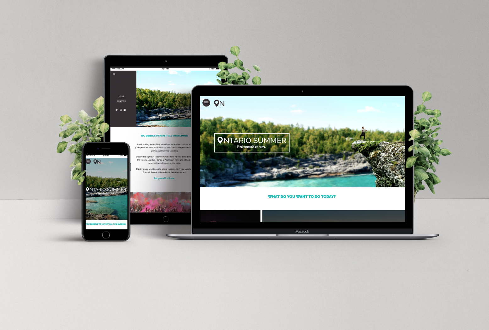
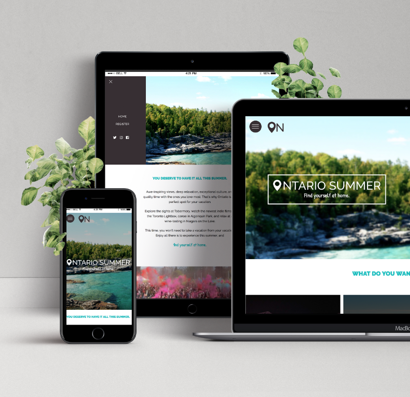

# Ontario Summer

Hackathon - MidTerm Winter 2019

### Team

- PROJECT MANAGER: Emma Blue
- GRAPHIC DESIGNER: Alderson Mariah
- FRONT-END WEB DEVELOPER: Daniela Dantas
- BACK-END WEB DEVELOPER: Camillo Angelozzi
- MOTION/3D ARTIST: Jacob Atkinson

This site is a marketing campaign to attract tourists from outside Ontario to the province over the summer. We used a parallax scrolling effect for the landing page, coded a custom registration form connected to the MailChimp API to add each registered user to a MailChimp email list, and created an original tourism video.

## Tools used during development phase:
- Adobe Illustrator, Photoshop, After Effects, XD, Premiere
- PHP/MySQL
- Gulp.js
- SASS
- Javascript Fetch API, to get data from backend database
- https://developer.mailchimp.com/ - Mailchimp API

### Giving credits for places that helped to do this project

- https://stackoverflow.com/
- https://airbnb.io/lottie/web/web.html
- https://sass-lang.com/
- https://developer.mailchimp.com/documentation/mailchimp/
- https://mailchimp.com/

### Future Improvements
- Social Media Feeds
- Dynamic Events Page
- Backend and Database to be expanded.
